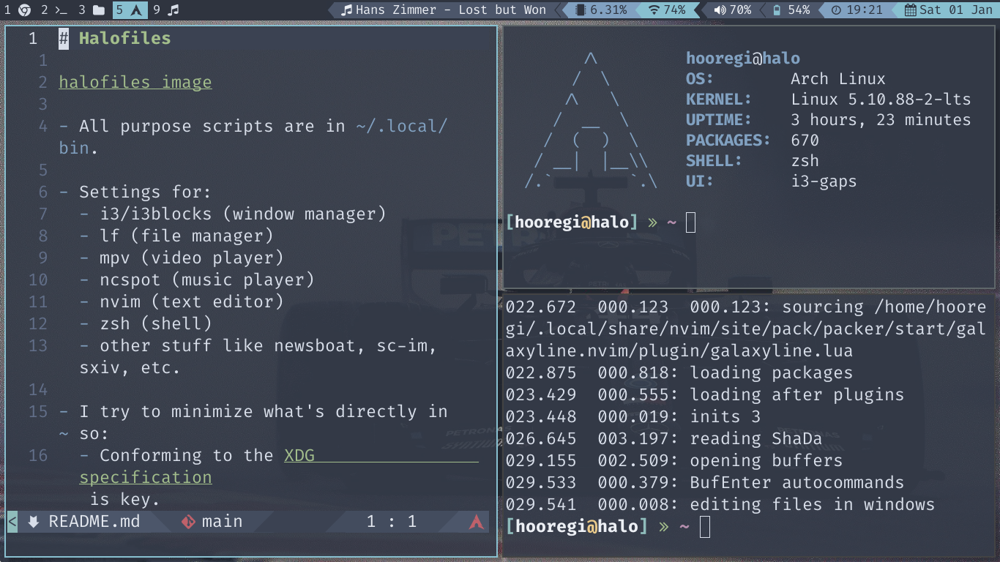

# Halofiles



- All purpose scripts are in `~/.local/bin`.

- Settings for:
  - lf (file manager)
  - mpv (video player)
  - ncspot (music player)
  - nvim (text editor)
  - zsh (shell)
  - other stuff like newsboat, sc-im, sxiv, etc.

- I try to minimize what's directly in `~` so:
  - Conforming to the [XDG](https://wiki.archlinux.org/title/XDG_Base_Directory) specification is crucial.
  - All configs that can be in `~/.config/` are.
  - Environment variables are set in `~/.zprofile`.

## Install

You will need GNU `stow`.

Clone into your `$HOME` directory.

```bash
git clone https://gitlab.com/Hooregi/Halofiles.git
```

Run `stow` to symlink everything, or just select whatever you need.

```bash
stow . # everything (.stow-ignore is in place to prevent pulling the LICENSE, README, etc)
```

```bash
stow .config/zsh # just the zsh config
```

## Credit

Some of the scripts are from Luke Smith's [dotfiles](https://github.com/LukeSmithxyz/voidrice). Likewise, the `zsh-functions` come from Chris Chiarulli's [dotfiles](https://github.com/ChristianChiarulli/Machfiles).
